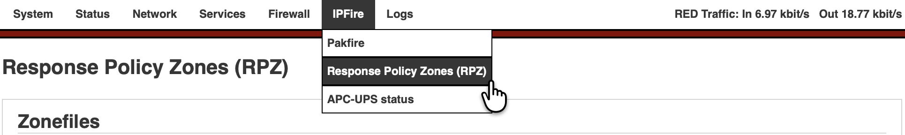
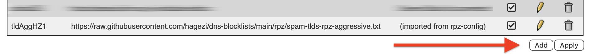
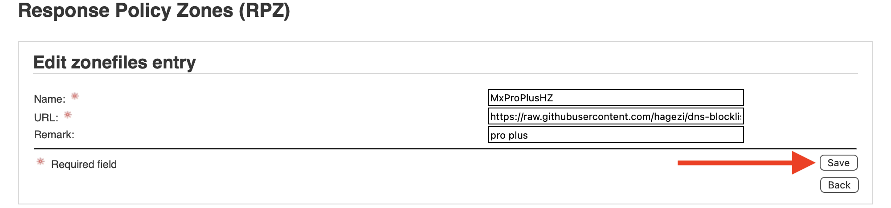
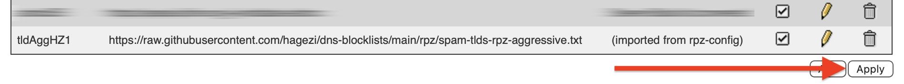
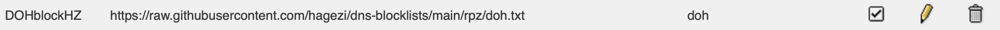
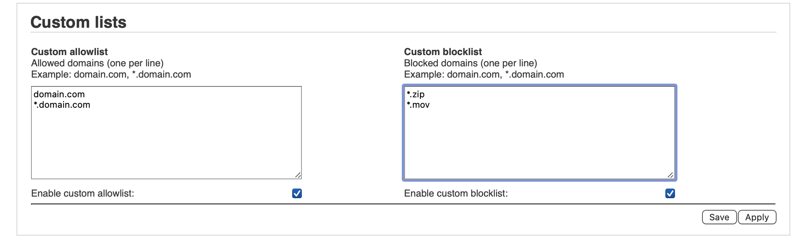
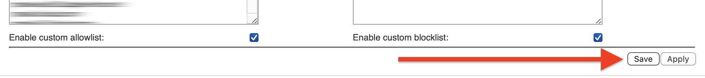
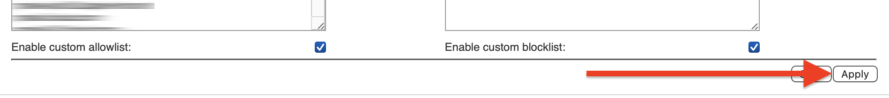
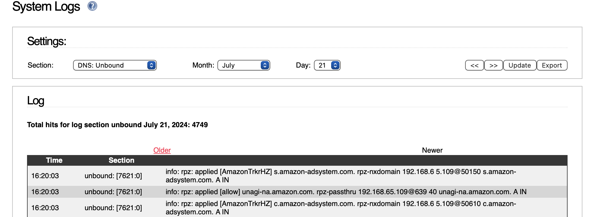

# Response Policy Zones (RPZ)

The RPZ Add-on enhances IPFire’s built-in DNS resolver, Unbound, by integrating Response Policy Zone (RPZ) functionality. RPZ is a standardized mechanism for defining local DNS policies and loading them from external sources. This approach is similar to standalone tools like Pi-hole but is integrated into IPFire, eliminating the need for a separate device on the network.

In practice, this means admins can easily block access to harmful sites — phishing pages, malware servers, ad networks, and similar threats — by intercepting DNS lookups before a connection is attempted. Since malicious domain names tend to change far less frequently than the IP addresses behind them, DNS-level blocking is an efficient and low-maintenance first line of defense. 

It's worth noting that RPZ only blocks the domain name lookup; if a user connects directly via IP address, RPZ will not intervene. For IP-based blocking, [IP Address Blocklists](https://www.ipfire.org/docs/configuration/firewall/ipblocklist) are the appropriate companion tool.

The RPZ add-on works by inserting roughly ten lines into Unbound's configuration (per list), along with a set of scripts that handle configuration of various RPZ sources and metrics. The external RPZ lists are downloaded by Unbound itself and the add-on's scripts are responsible only for configuration and setup.

A local allowlist and blocklist are also included — the allowlist lets admins exempt legitimate sites that may be incorrectly flagged and need to stay accessible. The blocklist allows for custom blocking rules on top of the external RPZ sources.


## Installation
The RPZ add-on (test version) is installed manually.  To install, enter these commands:

```bash
# 1 - go to this directory:
cd /opt/pakfire/tmp/

# 2 - download RPZ add-on file:
curl --location \
  --url https://github.com/JonMurphy/RPZ_add-on/releases/latest/download/rpz-latest.ipfire.tar \
  --output rpz-latest.ipfire.tar

# 3 - list the directory and confirm file exists:
ls -l /opt/pakfire/tmp

# 4 - uncompress the file:
tar --verbose --extract --file="rpz-latest.ipfire.tar"

# 5 - check to make sure there are five (5) files:
ls -l /opt/pakfire/tmp

# 6 - copy one file to a new location:
/bin/cp --verbose --force ROOTFILES /opt/pakfire/db/rootfiles/rpz

# 7 - install (or update or uninstall) RPZ
NAME=rpz ./install.sh
# -or-    NAME=rpz ./update.sh
# -or-    NAME=rpz ./uninstall.sh
```


## Usage
To open the RPZ WebGUI, go to menu **IPFire** > **Response Policy Zones (RPZ)**:

<p align="center">
  
</p>


## Zonefiles section
View a list of RPZ Names, URLs, and a short Remark for each zonefile item. Too many RPZ lists will slow down Unbound DNS.

### Add
To add a new RPZ list, click the **Add** button in the lower right corner of the Zonefiles section.

<p align="center">
  
  <br />
  <small><em>click Add</em></small>
  <br />
</p>

Add a Name and the URL of a RPZ list.  A small remark can also be added.  Then click **Save**.

<p align="center">
  
  <br />
  <small><em>example Edit window</em></small>
</p>

Multiple adds or edits can be done at one time before clicking **Apply**.

**Note**: Remember to press **Apply** after you have finished your modifications.  The **Apply** sends an `unbound-control reload` which loads the various RPZ configuration files.

<p align="center">
  
  <br />
  <small><em>Do not forget to click Apply</em></small>
</p>

### Edit
To edit an existing line, click on the pencil.

<p align="center">
  
  <br />
  <small><em>click on pencil</em></small>
</p>

Make the needed changes and then click **Save**.

<p align="center">
  
  <br />
  <small><em>click on Save after edit</em></small>
</p>

Multiple adds or edits can be done at one time (before clicking **Apply**).

**Note**: Remember to press **Apply** after you have finished your modifications. The **Apply** sends an `unbound-control reload` which loads the various RPZ configuration files.

<p align="center">
  
  <br />
  <small><em>Do not forget to click Apply</em></small>
</p>


## Custom lists section
List of allowlist domains and blocklist domains.  Clicking apply loads the custom allowlist and blocklist into unbound RPZ.

<p align="center">
  
  <br />
  <small><em>example custom lists</em></small>
</p>


Domains are entered in this format:

```bash
domain.com
subdomain.domain.com

# to include all subdomains within a domain, add the "*" to the start of the line
*.domain.com
*.subdomain.domain.com
```

**Note**: the asterisk `*` is only allowed as the first character in the line.   It represents all subdomains within a given domain.

### Allowlist
At times an outside RPZ list will block a needed website. Allowed domains can be added to this list and thus unblock that domain.

### Blocklist
The block list operates in a similar way to the allowlist. After making changes to the custom allow/block lists, click **Save**.

<p align="center">
  
  <br />
  <small><em>click on Save after changes</em></small>
</p>

Multiple adds or edits can be done at one time (before clicking **Apply**).

**Note**: Remember to press **Apply** after you have finished your modifications.

<p align="center">
  
  <br />
  <small><em>click on Apply</em></small>
</p>

## Logging
RPZ logging can be found within the unbound logs.  Go to **Logs** > **Systems Logs**, click on **DNS: Unbound** in the drop-down, and then click the **Update** button.

<p align="center">
  
  <br />
  <small><em>example of RPZ in system logs</em></small>
</p>


### Notes
 1. Large RPZ files will slow down the unbound reload time and slow down a DNS lookup.  Over 500,000 lines of RPZ files (total lines for all RPZ files) is discouraged. Over 1,000,000 lines of RPZ files (total lines for all RPZ files) is NOT recommended.
    - the Hagezi Threat Intelligence Feed (largest size) is **NOT** recommended due to its large size (lines = 1,354,431)
        - Hagezi TIF medium or TIF mini should be fine.
    - the Hagezi Gambling (largest size) is **NOT** recommended due to its large size (lines = 937,035)
        - Hagezi Gambling medium or Gambling mini should be fine.

 2. Keep in mind there may be overlap between an RPZ list and a list offered in [IP Address Blocklists](https://www.ipfire.org/docs/configuration/firewall/ipblocklist).  Please review the lists chosen before activating.


## Recommended RPZ lists
 1. [Hagezi - DNS Blocklists](https://github.com/hagezi/dns-blocklists?tab=readme-ov-file#zap-dns-blocklists---for-a-better-internet)
 2. [ThreatFox - DNS Response Policy Zone (RPZ)](https://threatfox.abuse.ch/export/#rpz)
 3. [URLHaus - DNS Response Policy Zone (RPZ)](https://urlhaus.abuse.ch/api/#rpz)
 4. [jpgpi250 - DNS block list for DoH](https://github.com/jpgpi250/piholemanual)


## RPZ console commands
See the RPZ console commands here --> [Using the RPZ Console](docs/rpz_console.md)


## Links
 * [dnsrpz.info - DNS Response Policy Zones](https://dnsrpz.info)
 * [Wikipedia - Response policy zone](https://en.wikipedia.org/wiki/Response_policy_zone)
 * [unbound - Response Policy Zones](https://unbound.docs.nlnetlabs.nl/en/latest/topics/filtering/rpz.html)

#### Appreciations

This effort, which began in mid-2023, involves numerous volunteers who have generously offered their guidance, time spent developing new code, time spent testing, and their overall and much appreciated support.  This is what a Community effort is all about!

 - A thank you to [Peter Russell @ jpgpi250](https://github.com/jpgpi250/piholemanual)  for his work, his PDF documents, and his time answering my newbie questions around RPZ.  His work is the inspiration for this project.

 - A thank you to Bernhard Bitsch @ bbitsch for his suggestions, BIG help with rpz-metrics, testing of the first versions (with detailed bug reports!), and kind words when I was down.

 - A thank you to Leo Hofmann @ luani for his coding efforts around the RPZ WebGUI (rpz.cgi).  I wish I could code like that!

 - And an extra big "Thank you!" to the many volunteer testers.

PS - There were many excellent options, enhancements, and additional functionality that were suggested along the way.  My apologies for not getting those implemented.

[^1]: [https://unbound.docs.nlnetlabs.nl/en/latest/topics/filtering/rpz.html](https://unbound.docs.nlnetlabs.nl/en/latest/topics/filtering/rpz.html)
